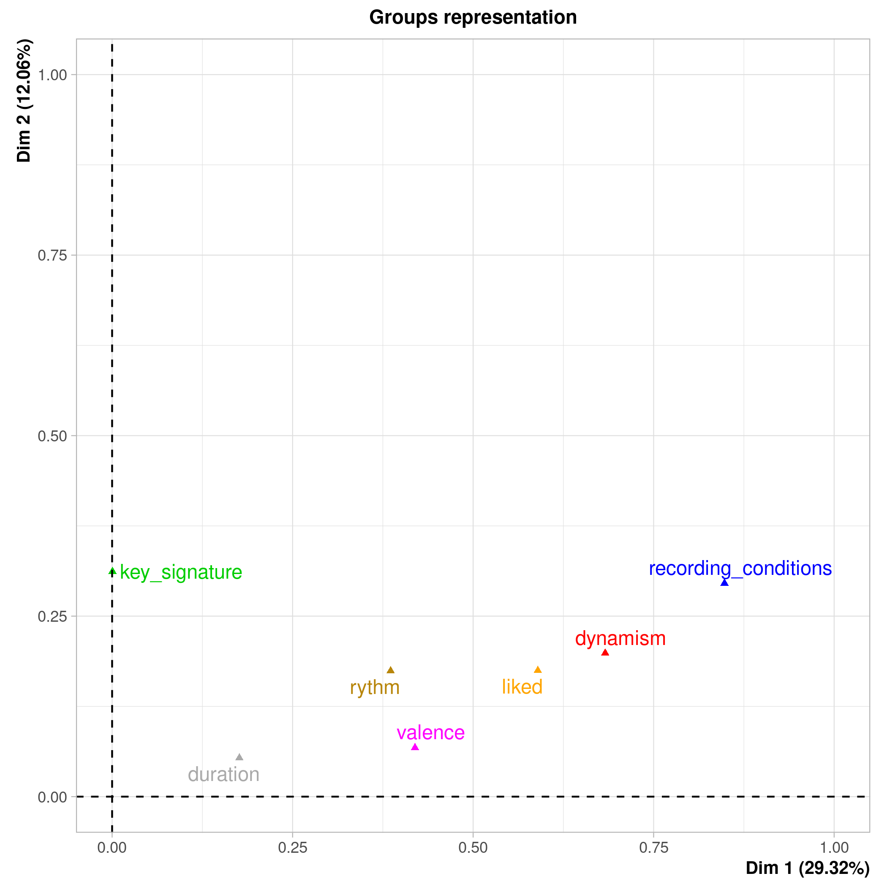

# 
Rapport d'étude

## 
Ryan RISS et Valentin RICHARD

## Objectif de l'étude
L'objectif de cette étude est avant tout de se familiariser avec le language R et les outils d'informatique décisionel. Comme cas pratique, nous avons séléctionné un dataset sur lequel nous allons essayer d'obtenir des conclusions.

## Présentation du dataset
Comme dit dans l'introdution du README, le dataset contient environ 200 chansons venant de la plateforme de streaming Spotify. Sur chacune de ces chansons, on dispose de plusieurs variables en plus de l'appréciation de l'auteur du dataset.

Pour entrer dans les détails, voici la liste complète des variables :

<ul>
<li><b>danceability</b> (0. - 1.) : caractère dansant de la musique,</li>
<li><b>energy</b> (0. - 1.) : l’énergie dégagée par la musique</li>
<li><b>key</b> (0 - 11) : variable qualitative pour représenter la clé de la partition, de Do à Si,</li> 
<li><b>loudness</b> (-43. - -2.) : décibel moyen de la musique, </li>
<li><b>mode</b> (0 - 1) : attribut de classe pour représenter la valeur 'majeure' ou 'mineur' associée à la clé</li>
<li><b>speechiness</b> (0. - 1.) : proportion de partie vocale dans la musique,</li>
<li><b>acousticness</b> (0. - 1.) : proportion d’instruments acoustiques,</li>
<li><b>instrumentalness</b> (0. - 1.) : proportion de partie instrumentalles dans la musique,</li>
<li><b>liveness</b> (0. - 1.) : détection d'une audience dans l’enregistrement, </li>
<li><b>valence</b> (0. - 1.) : le taux de positivité de la musique,</li>
<li><b>tempo</b> (60. - 180.) : BPM de la musique, </li>
<li><b>duration_ms</b> : la durée de la musique en milliseconde, </li>
<li><b>time_signature</b> (1-5) : attribut de classe pour reprenter le chiffrage des mesures (type  binaire ou terneire par exemple),</li>
<li><b>liked_song</b> (0-1) : classe, l’auteur du dataset a aimé ou non la musique.</li>
</ul>

Il est à noter que ce dataset a été créé par un utilisateur de Spotify. Il reflète donc les goûts musicaux d’un seul utilisateur de la plateforme.

## Partie 1 : l'ACP et l'AFM
Pour essayer d'avoir une vue d'ensemble du dataset, nous commençons par utiliser des outils permettant de visualiser toutes les variables. Pour ce faire, notre première analyse se fera avec une ACP.

### L'ACP
Pour essayer d'analyser les données, nous allons réaliser une ACP sur ces dernières. Les données étant toutes qualitatives, nous allons toutes les retrouver dans cette analyse. L'ACP va nous permettre d'observer le comportement des variables les unes en fonction des autres. De plus, nous allons déterminer s'il est possible de réduire l'ensemble des données dans une espace de plus faible dimension.  

Pour commencer, les regardons les valeurs propres associées à l'analyse. Voici le résultat pour le 6 premières (sur les 14 totales) :

Nous contatons que les deux premières valeurs propres expliquent moins de 50% des données, ce qui n'est pas si mal. Il faudra tout le même rester prudent sur les conclusions qui suivront.

Pour en savoir plus sur les liens entre les variables, nous nous tournons vers le graphe des variables (ci-dessous).

Dans ce graphique, on peut voir plusieurs choses, entre autre : 
<ul>
<li>Que l'on ne peut conclure que sur la moitié des varibles,</li>
<li>Que la variable _energy_ est négativement corrélé avec _acousticness_</li>
<li>Que _liked_ semble positivement corrélé avec _danceability_ et _speechiness_, ce qui tant à dire que l'auteur de ce dataset aime les musiques dansantes et contenant beaucoup de paroles (en proportion du temps de la musique)</li>
</ul>

<!-- Pour finir cette analyse, voici le graphe des individus :

 -->

Nous avons essayé de recommencer l'analyse avec d'autres couples de dimensions (1 et 3, 2 et 3) mais les résultats ne sont pas significatifs et nous obtenons à peu près la même chose qu'avec l'analyse précedente.

Nous dérisons maintenant regrouper les variables selon leurs significations pour visualiser les grands axes qui définissent une musique.

### L'AFM
C'est l'AFM qui va nous permettre de créer des groupes de varibales pour analyser leur comportement globale. Voici les groupes que nous avons formé pour réaliser l'analyse : 
<table>
<tr>
   <td><b>id</b></td>
   <td><b>nom du groupe</b></td>
   <td><b>variables</b></td>
</tr>
<tr>
   <td>1</td>
   <td>dynamism</td>
   <td>danceability energy loudness</td>
</tr>
<tr>
   <td>2</td>
   <td>key_signature</td>
   <td>key mode</td>
</tr>
<tr>
   <td>3</td>
   <td>recording_conditions</td>
   <td>speechiness acousticness instrumentalness liveness</td>
</tr>
<tr>
   <td>4</td>
   <td>valence</td>
   <td>valence</td>
</tr>
<tr>
   <td>5</td>
   <td>rythm</td>
   <td>tempo time_signature</td>
</tr>
<tr>
   <td>6</td>
   <td>duration</td>
   <td>duration_ms</td>
</tr>
<tr>
   <td>7</td>
   <td>liked</td>
   <td>liked</td>
</tr>
</table>

C'est pour réaliser ces groupes que nous avons modifié l'ordre des colonnes dans le fichier 2_pca_mfa.R. Lorsque nous réaliser l'analyse, voici le pourcentage d'explications des données en fonction des valeurs propres : 

Les deux premières valeurs propres expliquent donc 40% des données, ce qui n'est pas si mal nous semble-t-il. 

Voici alors le graphe des axes partiels : 

Il semble diificile de tirer des coclusions raisonnables de ce graphe. Nous nous tournons alors vers e graphe des groupes pour essayer d'y voir un peu plus clair.

Sur ce graphique, et en nous aidant du précedent, nous constatons que la variable liked semble le plus proche du groupe dynamism. On a donc une approximation de ce à quoi l'auteur du dataset porte le plus attention lorsqu'il ou elle écoute une musique.

Enfin, des tabelaux des coefffcients Lg et RV, nous ne tirons rien de plus. Finalement, l'analyse AFM ne nous aura pas tellementaidé à appréhender les données.

C'est pourquoi nous allons désormais nous interesser aux varibales de manière individuelles. Pour ce faire, nous allons commencer par réaliser des modèles de régression linéaire.

## Partie 2 : la régression linéaire
### La varibale energy
La première variable que nous avons voulu expliquer, est la varibale energy. On peut supposer d’une musique énergique l’est par sa positivité (valence), sa danceability, son caractère bruyant (_loudness_) et par sa liveness.

Faisons une régression linéaire de la variable energy selon celles qu’on suppose pertinentes pour l’expliquer.

Voici les résultats :

On peut remarquer que nos suppositions sont plutôt bonnes, sauf pour la liveness. En effet, toutes les variables explicatives sont statiquement significatives (sauf liveness). De plus le r2 ajusté vaut 0.77, ce qui n’est pas parfait mais plutôt bon. 

Cependant, selon notre modèle, plus une musique est énergique moins est sera probable d’être dansante, ce qui peut paraître contradictoire mais concordre avec ce que nous avions constaté dnas la partie précédente.

Nous décidons de ne pas appronfondir ce modèle, et nous tounons vers une autre varible.

### La variable danceability 
Pour la variable danceability on va procéder en supposant que toutes les variables autres que danceability et les variables qualitatives sont explicatives.

Voici les résultats : 

On peut voir qu’on a un r2 ajusté de 0.74, ce qui est plutôt bon, 74% des données sont expliquées par le modèle.

On remarque aussi que le tempo et la durée de la musique ne sont pas du tout des variables statistiquement significatives. Ce qui est étonnant car on pourrait supposer qu’un tempo rapide témoigne d’une musique dansante.

De plus, on peut noter que la variable intrumentalness est grande moins la musique sera considéré comme dansante, c’est l’inverse qui se produit avec la variable speechiness. Cela est logique étant donné qu’intrumentalness et speechiness sont des variables “antagonistes”.

Les variables loudness et valance permettent d’expliquer positivement qu’une musique est dansante et que plus la présence d’instrument électronique est grande, plus la musique est dansante.

On a aussi la variable energy qui est négativement explicative de danceablity, comme dans la régression linéaire précédente.

On peut ainsi enlever les variables tempo et duration_ms dans notre modèle.

Voici les nouveaux résultats :

Le r2 ajusté a très légèrement baissé et la variable _acousticness_ n'est plus statistiquement significative mais le modèle reste plutôt bon. Il reste améliorable enenlevan la variable _acousticness_. C'ets ec que nous faisons, mais la variable liveness devient à son tour non statistiquement significative. Nous la retirons également. 

Voici le modèle final pour expliquer la variable danceability : 

Le r2 n'a presque pas bougé depuis le premier modèle proposé,  mais nousa vons retiré 3 varibales explicatives (33%). Le modèle est satisfaisant pour expliquer la variable danceability. 

## Partie 3 : la régression logistique
Dans le dataset il y a plusieurs variables qualitatives : key, mode, time_signature et liked.
Nous ne les avons pas utilisées pour l’instant dans nos analyses, c’est maintenant qu’on va le faire grâce à la régression logistique.

On veut pouvoir déterminer quelles musiques ont été aimées selon leurs caractéristiques.

Après plusieurs tests en essayant de baisser l’AIC au maximum et en ne gardant que des variables statistiquement significatives on arrive à ce résultat : 

On a donc les variables danceability, loudness (le groupe 'dynamism' dans l'AFM), speechiness, tempo et duration_ms qui permettent d’expliquer la variable qualitative liked. On remarque que plus une musique est longue, plus elle ne sera probablement pas aimée par l’utilisateur.

On peut expliquer que ces variables sont explicatives de liked par les goûts musicaux du créateur du dataset. En effet, il cite : "It is mainly French Rap , sometimes American rap , rock or electro music. For those I dislike , I collected songs from various kind of music so the model will have a broader view of what I don't like."

Étant donné qu’il est un grand fan de rap, le fait que les variables loudness ou speechiness soient présentes dans notre modèle n’est pas étonnant. 

Pour encore améliorer le modèle de prédiction, nous étudions l'impact du seuil sur les résultats. Pour ce faire, nousa llons calculer la précision et le rappel des modèles avec différents seuils.

1. Seuil > 0.5 : 

<table>
<tr>
   <td></td>
   <td><b>Précision</b</td>
   <td><b>Rappel</b></td>
</tr>
<tr>
   <td><b>0</b></td>
   <td>17/(17+1) = 0.92</td>
   <td>17/(17+2) = 0.89</td>
   </tr>
<tr>
   <td><b>1</b></td>
   <td>19/(19+2) = 0.90</td>
   <td>19/(19+1) = 0.95</td>
</tr>
</table>

2. Seuil > 0.8 : 

<table>
<tr>
   <td></td>
   <td><b>Précision</b</td>
   <td><b>Rappel</b></td>
</tr>
<tr>
   <td><b>0</b></td>
   <td>18/(18+6) = 0.75</td>
   <td>18/(18+1) = 0.95</td>
   </tr>
<tr>
   <td><b>1</b></td>
   <td>14/(14+1) = 0.93</td>
   <td>14/(14+6) = 0.7</td>
</tr>
</table>

3. Seuil > 0.2 : 

<table>
<tr>
   <td></td>
   <td><b>Précision</b</td>
   <td><b>Rappel</b></td>
</tr>
<tr>
   <td><b>0</b></td>
   <td>16/16 = 1</td>
   <td>16/(16+3) = 0.84</td>
   </tr>
<tr>
   <td><b>1</b></td>
   <td>20/(20+3) = 0.87</td>
   <td>20/(20+0) = 1</td>
</tr>
</table>

Ainsi, on peut voir qu’il y a déjà une énorme différence entre un seuil à 0.2, à 0.5 et celui à 0.8. Un seuil à 0.5 voire 0.2 semble bien meilleur qu’un seuil à 0.8. En effet, même si le seuil à 0.5 ou 0.2 a légèrement plus tendance à prédire des musiques pouvant être aimé alors que dans la réalité elles ne le sont pas (faux positifs), dans un cas d’algorithme de recommandation de musique un seuil à 0.5 voire 0.2 serait plus pertinent car on évite de louper des musiques pouvant être aimées par l’utilisateur.

## Conclusion
En conclusion, nous avons pu comprendre les préférences musicales d'une personne grâce à ses données. Il faut toutefois noter que, pour la régression logistique, ces données sont limitées et il aurait été préférable de disposer de plus de chansons dans le dataset. Cela dit, c'est éthode pourrait être généralisé à plusieurs utilisateurs pour créer un "détecteur de tube" par exemple, si l'ont dispose de suffisament de données.
Au delà de ça, nous avons pu mener notre propre démarche à l'aide d'outils vu en cours ce qui était très appréciable.